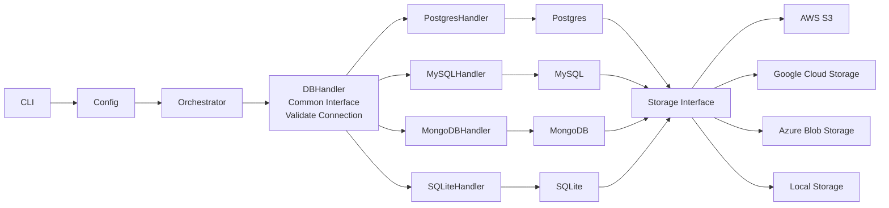

# BackupDB Design & Implementation Details

This document contains the architecture diagrams, design justifications, and Low-Level Design (LLD) specifications for BackupDB.

---

## Design Diagram

---

## Design Explanation (Mapped to Problem Statement)

- **CLI & Config**: The CLI layer captures all database configurations (engine type, credentials, host/port, database name), backup/restore mode, compression formats, and storage backend settings. The configuration layer resolves these with strict precedence (CLI flags > Environment variables > Configuration file > Defaults) and redacts secrets when emitting logs or outputs.
- **Orchestrator**: Enforces a robust orchestrating workflow for backup and restore operations. It queries the target database connection, validates the storage backend targets, coordinates compression pipeline streaming, calculates integrity hashes (SHA256) on-the-fly, and triggers completion callbacks (e.g., Slack notification webhooks) upon termination.
- **DBHandler (Common Interface)**: Exposes a standardized contract ([DbHandler](file:///Users/drumilbhati/Documents/BackupDB/internal/db/db.go)) across all target DBMS engines (Postgres, MySQL, MongoDB, SQLite). DB-specific details such as streaming commands (`pg_dump`, `mysqldump`, `mongodump`, SQLite file copies) are encapsulated behind this interface.
- **Storage Interface**: Exposes a standardized contract ([StorageAdapter](file:///Users/drumilbhati/Documents/BackupDB/internal/storage/storage.go)) for artifact persistence across different storage providers (Local, S3, GCS, Azure Blob). This enables the Orchestrator to stream backup and restore payloads directly to and from these backends without coupling database logic to the storage provider.

---

## Low-Level Design (LLD)

### 1. CLI Component
The command-line interface uses Cobra to register commands and flags. Supported subcommands:
- `backup`: executes database backup pipelines.
- `restore`: executes database restore pipelines.
- `validate`: runs connection tests for the configured database.
- `config`: evaluates and prints resolved configurations with redacted passwords and access keys.
- `version`: prints binary version information.

### 2. Configuration (`internal/config`)
Config resolution leverages Viper, ensuring flags override environment variables and configuration files.
**Credentials Redaction**: A deep copy/redaction routine replaces passwords, tokens, and secret access keys with `[REDACTED]` prior to JSON/Text rendering.

### 3. Database Handlers (`internal/db`)
Implements specific drivers and subprocess-piping tools for DBMS targets:
- **SQLite**: Direct DB file interaction and `.dump` stream piping.
- **Postgres**: Connection validation using the native `pgx` driver and streaming dumps via `pg_dump`/`psql`.
- **MySQL**: Connection validation via `go-sql-driver/mysql` and streaming dumps via `mysqldump`/`mysql`.
- **MongoDB**: Connection validation via the official Go Mongo Driver and streaming dumps via `mongodump`/`mongorestore`.

### 4. Storage Adapters (`internal/storage`)
- **Local**: Absolute path validation, folder creation, and direct local writes.
- **AWS S3**: Integration via `aws-sdk-go-v2` for multipart uploads and key reads.
- **GCS**: Integration via `cloud.google.com/go/storage` using service account key files.
- **Azure Blob**: Integration via `github.com/Azure/azure-sdk-for-go/sdk/storage/azblob` for block blob uploads and downloads.

### 5. Orchestrator (`internal/orchestrator`)
Ties DBHandlers and StorageAdapters together. Manages on-the-fly SHA256 checksum tracking, compression (`gzip`/`zstd`), and webhook notification dispatches.
