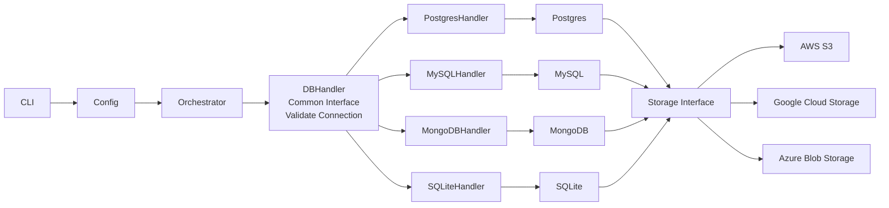

# BackgroundDB

Database backup and restore utility that targets multiple DBMS engines with flexible storage backends.

## Design diagram



## Design explanation (mapped to the problem statement)

**CLI → Config** captures all required connection parameters (host, port, username, password, database name), backup/restore mode, compression preferences, and storage target. This layer is responsible for validating that mandatory inputs are present and for providing clear help and defaults, directly supporting the usability and portability goals.

**Orchestrator** coordinates the end-to-end workflow for both backup and restore. It selects the correct DB handler based on the DBMS type, enforces connection validation before any operation, and ensures failures are surfaced with clear errors. It is also the right place to record start/end time, duration, status, and errors, and to trigger optional Slack notifications after completion, aligning with the logging and notification requirements.

**DBHandler (Common Interface / Validate Connection)** provides a single contract across all database engines. Each concrete handler (Postgres/MySQL/MongoDB/SQLite) implements DB-specific backup and restore logic, including selective restore when the engine allows it, and full/incremental/differential backups when available. This isolates DBMS differences while keeping reliability and performance goals intact (e.g., using incremental/differential strategies to reduce load on large databases).

**Storage Interface** abstracts how backup artifacts are persisted. The diagram shows cloud targets (AWS S3, Google Cloud Storage, Azure Blob Storage); the same interface also supports local filesystem storage as required. By keeping storage behind a dedicated interface, the system can stream compressed backups to different destinations without changing DB-specific logic, improving scalability and reliability across platforms.

## LLD solution

### CLI

The CLI is a single cross-platform binary (`backupdb`) with subcommands. It parses flags, loads configuration, validates inputs, and invokes the orchestrator with a normalized request object.

**Commands**

| Command | Purpose | Required inputs (core) |
|---|---|---|
| `backup` | Create a backup | `--db`, `--host`, `--port`, `--user`, `--password`, `--database`, `--storage` |
| `restore` | Restore from a backup | `--db`, `--backup-path`, `--database` |
| `validate` | Validate connection only | `--db`, `--host`, `--port`, `--user`, `--password`, `--database` |
| `config` | Show/validate resolved config | none |
| `version` | Print version | none |
| `help` | CLI help | none |

**Option groups (core contract)**

| Category | Options |
|---|---|
| DB selection | `--db {postgres|mysql|mongodb|sqlite}` |
| Connection | `--host`, `--port`, `--user`, `--password`, `--database` |
| Backup mode | `--mode {full|incremental|differential}` |
| Compression | `--compress {none|gzip|zstd}`, `--compression-level` |
| Storage | `--storage {local|s3|gcs|azure}` plus provider flags (e.g., bucket/container, region, prefix, credentials) |
| Restore scope | `--tables` / `--collections` (DB-specific, optional) |
| Logging | `--log-file`, `--log-level` |
| Notifications | `--slack-webhook` (optional) |
| Output | `--output {text|json}` |

**Configuration precedence**

1. CLI flags  
2. Environment variables (prefix `BACKUPDB_`)  
3. Config file  
4. Defaults

**Config file contract (YAML example)**

```yaml
db:
  type: postgres
  host: localhost
  port: 5432
  user: backup
  password: ${BACKUPDB_PASSWORD}
  database: app
backup:
  mode: full
  compress: gzip
storage:
  type: s3
  bucket: my-backups
  prefix: prod/
logging:
  level: info
notifications:
  slackWebhook: https://hooks.slack.com/...
```

**Validation and execution flow**

The `validate` command performs connection checks only. `backup` and `restore` always invoke the same validation routine before performing any operation. Missing or incompatible flags (e.g., incremental mode for an unsupported DBMS) return an error with actionable messaging.

**Exit codes (enum-backed)**

| Enum | Code |
|---|---|
| `Success` | 0 |
| `InvalidInput` | 2 |
| `ConnectionFailure` | 3 |
| `BackupFailure` | 4 |
| `RestoreFailure` | 5 |
| `StorageFailure` | 6 |

**Output contract**

`text` output is human-friendly and concise; `json` output is machine-friendly and stable for automation. Errors never include secrets, and logging does not echo passwords or access keys.

### Config

The Config service resolves inputs from CLI flags, environment variables, and a config file; applies defaults; validates requirements; and returns a normalized configuration object for the orchestrator.

**Responsibilities**

1. Load and merge config sources with precedence (flags > env > file > defaults).
2. Validate required fields and DB/storage-specific constraints.
3. Normalize values into a single `Config` object.
4. Redact secrets for logs and diagnostics.

**Interfaces**

- `ResolveConfig(inputs) -> Config`
- `ValidateConfig(config) -> Diagnostic[]`
- `Redact(config) -> SafeConfig`

**Schema (core fields)**

| Section | Key fields |
|---|---|
| `db` | `type`, `host`, `port`, `user`, `password`, `database` |
| `backup` | `mode`, `compress`, `compressionLevel` |
| `storage` | `type`, `bucket/container`, `region`, `prefix`, `credentials` |
| `restore` | `backupPath`, `tables/collections` |
| `logging` | `level`, `file` |
| `notifications` | `slackWebhook` |
| `output` | `format` |

**Resolution flow**

1. Load config file (explicit path or default).
2. Load env vars with `BACKUPDB_` prefix.
3. Parse CLI flags.
4. Merge values by precedence and apply defaults.
5. Validate and return.

**Validation rules**

- Required: `db.type`, connection params, `storage.type` (backup), `backupPath` (restore).
- DB-specific constraints (e.g., `sqlite` ignores host/port; `mongodb` may accept URI).
- Mode support: reject incremental/differential where unsupported.
- Storage-specific fields: require bucket/container/region/credentials when needed.

**Error handling**

Fail fast with actionable messages (e.g., “--storage s3 requires --bucket”), and never include secrets in errors or logs.

### Orchestrator

The Orchestrator coordinates backup/restore execution by selecting handlers, enforcing validation, and driving the workflow lifecycle.

**Responsibilities**

1. Map resolved config to DB and storage handlers.
2. Run preflight validation (config + connection) before any operation.
3. Execute backup/restore stages in order.
4. Standardize error handling and map to exit codes.
5. Emit lifecycle events and trigger optional notifications.

**Interfaces**

- `RunBackup(request: BackupRequest) -> Result<BackupOutcome, OrchestratorError>`
- `RunRestore(request: RestoreRequest) -> Result<RestoreOutcome, OrchestratorError>`
- `SelectDbHandler(dbType) -> DbHandler`
- `SelectStorageAdapter(storageType) -> StorageAdapter`

**Input/Output contracts**

- **BackupRequest**: `db` (type, connection, mode, compression), `storage` (destination, credentials), `logging`, `notifications`, `output`.
- **BackupOutcome**: `backupId`, `artifactUri`, `bytes`, `checksum`, `duration`, `status`.
- **RestoreRequest**: `db`, `backupPath`, `scope`, `storage`.
- **RestoreOutcome**: `restoredObjects`, `duration`, `status`.

**Workflow (backup)**

1. Validate config.
2. `DbHandler.ValidateConnection`.
3. `DbHandler.PrepareBackup`.
4. `DbHandler.StreamBackup` → `StorageAdapter.Write`.
5. `DbHandler.FinalizeBackup`.
6. Emit logs/metrics and optional Slack notification.

**Workflow (restore)**

1. Validate config.
2. `DbHandler.ValidateConnection`.
3. `StorageAdapter.Read` → `DbHandler.StreamRestore`.
4. `DbHandler.FinalizeRestore`.
5. Emit logs/metrics and optional Slack notification.

**Error model**

Wrap lower-level failures into `OrchestratorError` with `kind` (Validation, Connection, Backup, Restore, Storage), an actionable `message`, and optional `cause`. Map `kind` to the exit code enum.

### DBHandler

The DBHandler interface defines the common contract each DB engine implements so the Orchestrator can run a uniform workflow.

**Interface (LLD)**

```
interface DbHandler {
  ValidateConnection(conn: DbConnection) -> Result<void, DbError>

  PrepareBackup(req: BackupRequest) -> Result<BackupContext, DbError>
  StreamBackup(ctx: BackupContext, sink: OutputStream) -> Result<BackupStats, DbError>
  FinalizeBackup(ctx: BackupContext, stats: BackupStats) -> Result<void, DbError>

  PrepareRestore(req: RestoreRequest) -> Result<RestoreContext, DbError>
  StreamRestore(ctx: RestoreContext, source: InputStream) -> Result<RestoreStats, DbError>
  FinalizeRestore(ctx: RestoreContext, stats: RestoreStats) -> Result<void, DbError>

  SupportsMode(mode: BackupMode) -> bool
  SupportsSelectiveRestore() -> bool
}
```

**Behavior**

- `ValidateConnection` runs before any operation.
- `Prepare*` and `Finalize*` allow DB-specific setup/cleanup.
- `StreamBackup/StreamRestore` enable streaming to reduce memory usage.
- `SupportsMode` and `SupportsSelectiveRestore` let the Orchestrator enforce constraints.

### Storage Interface

The Storage Interface is a single abstraction used by all DB handlers to persist and retrieve backup artifacts across different backends.

**Responsibilities**

1. Accept backup streams/artifacts and persist them to the selected backend.
2. Read artifacts back for restore.
3. Produce stable artifact references (URI + metadata).
4. Validate storage-specific requirements (credentials, bucket/container, path/prefix).
5. Ensure integrity (checksum) and handle retryable failures.

**Interface (LLD)**

```
interface StorageAdapter {
  ValidateTarget(config: StorageConfig) -> Result<void, StorageError>

  Write(
    input: InputStream,
    meta: ArtifactMetadata
  ) -> Result<ArtifactRef, StorageError>

  Read(
    ref: ArtifactRef
  ) -> Result<InputStream, StorageError>
}
```

**Core contracts**

- `ArtifactMetadata`: `dbType`, `backupMode`, `timestamp`, `checksum`, `sizeBytes`, `compression`, `labels`
- `ArtifactRef`: `uri`, `storageType`, `checksum`, `sizeBytes`

**Adapter selection**

- `StorageFactory.Select(storageType) -> StorageAdapter`
- Implementations: `LocalStorageAdapter`, `S3StorageAdapter`, `GCSStorageAdapter`, `AzureBlobStorageAdapter`

**Workflow**

1. Orchestrator selects adapter from config.
2. `ValidateTarget` runs.
3. `DbHandler.StreamBackup` → `StorageAdapter.Write`.
4. `StorageAdapter.Read` → `DbHandler.StreamRestore`.

**Error model**

`StorageError.kind`: `Config`, `Auth`, `Network`, `Quota`, `NotFound`, `Integrity` mapped to `StorageFailure`.